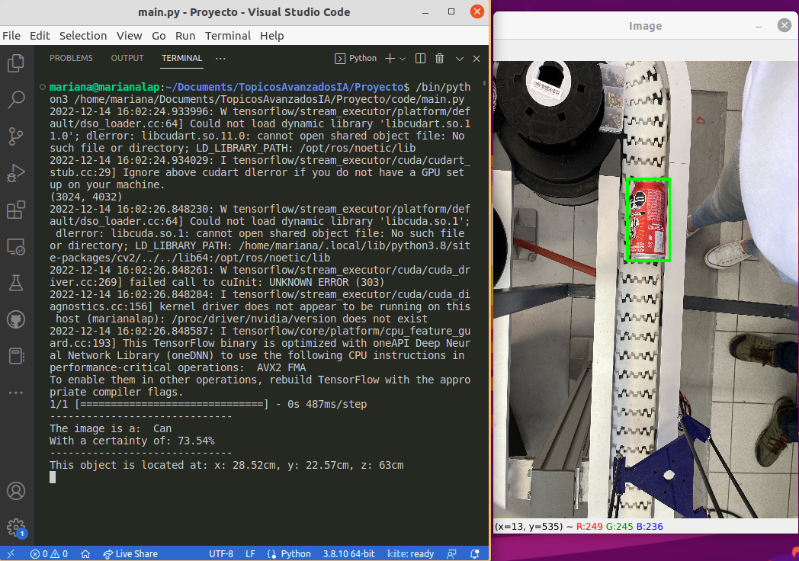

# Descripción
El presente proyecto consta del diseño de un sistema para la recolección de envases con un robot UR3e usando un modelo de clasificación de imágenes basado en redes neuronales.

# Imagen de demostración

