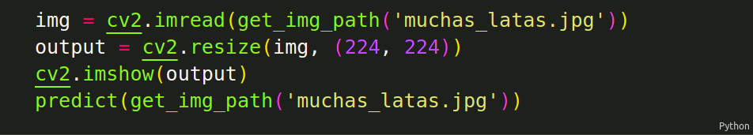

# Descripción
El presente proyecto consta del diseño de un sistema para la recolección de envases con un robot UR3e usando un modelo de clasificación de imágenes basado en redes neuronales.


El código del trabajo se encuentra en la carpeta code. A continuación se explicará qué contiene cada archivo y cómo ejecutarlos.

Para correr la mayoría de códigos es necesario contar con las librerías:
* TensorFlow
* TensorFlowHub
* Numpy
* Matplotlib
* Pandas

### Instalar las librerías necesarias
Para instalar los módulos siguientes se debe contar con Python y el manejador de paquetes `pip`. Para instalarlos se deberán correr los siguientes comandos:
```bash
pip install numpy
pip install opencv-python
pip install PIL
```


## WasteDetector.ipynb
Este Jupyter Notebook contiene todo el proceso desde la descarga y separación del dataset hasta el entrenamiento y guardado del modelo de clasificación. 
El correr este código implica que los datos obtenidos previamente serán reemplazados por los obtenidos al correr nuevamente las celdas del notebook.

Se recomienda usar desde GoogleColab. 

## PredictWaste.ipynb
Este Notebook permite probar el modelo de clasificación obtenido de WasteDetector.ipynb con cualquier imagen, para ejecutar este archivo de manera local se debe clonar el repositorio o descargarlo. Si se desea probar con alguna imagen que no esté en la carpeta images, se debe cargar la imagen a dicho directorio y crear una nueva celda en el notebook con la siguiente información:



## CanRectangle.ipynb
Este archivo contiene el código para la ubicación del centro de la lata usando filtros. Para correrlo solo es necesario correr cada celda del notebook.

## main.py
Este archivo es el programa principal, para probarlo solo es necesario correr el archivo. Para probar con una nueva imagen se debe tomar la fotografía desde una altura de 63cm (simulando así la altura de la cámara respecto al robot), y colocar el objeto a 28cm en el eje x, y 22cm en el eje, medidos desde la esquina superior izquierda. 

## waste_detector_model.h5
Es el archivo del modelo de clasificación, dicho archivo se puede cargar en cualquier programa ya sea de Python, Android, etc., para ser usado en cualquier aplicación para detectar los 4 tipos de envases de este proyecto.
